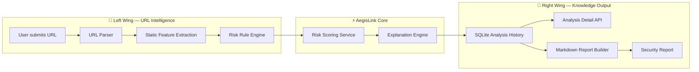

<div align="center">

# 🦋 AegisLink

### Defensive URL Risk Analysis API  
**Static link analysis • Risk scoring • Human-readable security explanations • Markdown reports**

<br />


<br />

**AegisLink is a Python/FastAPI backend API that analyzes suspicious URLs, explains possible risks in simple language, stores analysis history, and generates Markdown-style security reports.**

</div>

---

## ✨ Overview

AegisLink is a defensive cybersecurity backend project designed to help users understand why a link may be risky.

Instead of simply saying **safe** or **unsafe**, AegisLink breaks down the URL into understandable signals:

- Does it use HTTPS?
- Does it contain suspicious keywords?
- Is the URL unusually long?
- Does it use an IP address instead of a domain?
- Does it look like a brand impersonation attempt?
- Does it use suspicious TLDs or URL shorteners?

The goal is not to prove that a website is malicious.  
The goal is to provide **static, educational, defensive analysis** that helps users make safer decisions.

---

## 🧠 Why I Built This

Many people click links without understanding what makes a URL suspicious.

I built AegisLink because I wanted to create a backend system that explains security risks clearly. This project helped me practice backend architecture, API design, database modeling, cybersecurity logic, and AI-style explanation generation.

AegisLink is also part of my hackathon portfolio. It shows that I can build a real backend service with practical security use cases, clean documentation, and a working API flow.

---

## 🦋 Butterfly Architecture Scheme

AegisLink is designed like a butterfly:  
the left wing receives and analyzes the URL, the center performs the core risk decision, and the right wing stores results and generates reports.



---

## 🔥 Core Features

| Feature | Description |
|---|---|
| URL Analysis | Parses and normalizes submitted URLs |
| Static Security Checks | Detects suspicious URL patterns without visiting the website |
| Risk Scoring | Calculates a 0–100 risk score |
| Risk Levels | Classifies links as `LOW`, `MEDIUM`, `HIGH`, or `CRITICAL` |
| Human Explanation | Generates clear AI-style explanations |
| Safe Recommendations | Suggests defensive user actions |
| History Storage | Stores previous analysis results |
| Markdown Reports | Generates readable security reports |
| OpenAPI Docs | FastAPI-powered interactive API documentation |

---

## 🛡️ Detection Rules

AegisLink uses rule-based static analysis.

| Rule | What it Detects |
|---|---|
| Missing HTTPS | Links that do not use secure HTTPS |
| Missing Scheme | URLs submitted without `http://` or `https://` |
| Suspicious Keywords | Words like `login`, `verify`, `password`, `payment`, `bank`, `wallet` |
| Long URL | URLs that are unusually long |
| Very Long URL | URLs that may hide suspicious content |
| IP Address Domain | URLs using an IP address instead of a domain |
| Too Many Subdomains | Domains with suspiciously deep nesting |
| Suspicious TLD | TLDs such as `.zip`, `.mov`, `.click`, `.top`, `.xyz`, `.loan` |
| URL Shortener | Services like `bit.ly`, `tinyurl.com`, `t.co` |
| Brand Impersonation Hint | Brand-like names used in suspicious contexts |

> AegisLink does not claim that a URL is definitely malicious. It only identifies static risk signals.

---

## ⚙️ Tech Stack

| Layer | Technology |
|---|---|
| Language | Python |
| Backend Framework | FastAPI |
| Validation | Pydantic |
| Database ORM | SQLAlchemy |
| Database | SQLite |
| Testing | Pytest |
| Server | Uvicorn |
| Documentation | OpenAPI / Swagger |

---

## 📡 API Endpoints

| Method | Endpoint | Description |
|---|---|---|
| `GET` | `/health` | Service health check |
| `POST` | `/api/v1/analyses` | Analyze a suspicious URL |
| `GET` | `/api/v1/analyses` | List analysis history |
| `GET` | `/api/v1/analyses/{analysis_id}` | Get analysis detail |
| `GET` | `/api/v1/reports/analyses/{analysis_id}` | Generate a Markdown security report |

---

## 🚀 Quick Start

### 1. Clone the repository

```bash
git clone https://github.com/FluxKnight/AegisLink.git
cd AegisLink/backend
```

### 2. Create a virtual environment

```bash
python -m venv .venv
```

### 3. Activate the environment

macOS / Linux:

```bash
source .venv/bin/activate
```

Windows PowerShell:

```powershell
.venv\Scripts\Activate.ps1
```

### 4. Install dependencies

```bash
pip install -r requirements.txt
```

### 5. Run the API

```bash
uvicorn app.main:app --reload
```

### 6. Open API docs

```text
http://127.0.0.1:8000/docs
```

---

## 🧪 Example Request

```bash
curl -X POST "http://127.0.0.1:8000/api/v1/analyses" \
  -H "Content-Type: application/json" \
  -d '{"url": "https://paypal-login-security.example.com/verify-account"}'
```

---

## 📦 Example Response

```json
{
  "id": 1,
  "original_url": "https://paypal-login-security.example.com/verify-account",
  "normalized_url": "https://paypal-login-security.example.com/verify-account",
  "domain": "paypal-login-security.example.com",
  "scheme": "https",
  "risk_score": 75,
  "risk_level": "CRITICAL",
  "findings": [
    {
      "code": "SUSPICIOUS_KEYWORD",
      "title": "Suspicious keyword detected",
      "description": "The URL contains account, login, or verification-related words often used in phishing-style links.",
      "weight": 20
    },
    {
      "code": "BRAND_IMPERSONATION_HINT",
      "title": "Possible brand impersonation hint",
      "description": "The URL contains a recognizable brand-like word in a suspicious context.",
      "weight": 20
    }
  ],
  "explanation": "This URL may be risky because it uses account verification language and brand-like wording. This does not prove the link is malicious, but it should be treated carefully.",
  "recommendations": [
    "Do not enter passwords or payment information.",
    "Open the official website manually instead of clicking the link.",
    "Verify the sender through an official channel."
  ],
  "created_at": "2026-05-25T12:00:00"
}
```

---

## 📄 Markdown Report Example

AegisLink can generate a readable report from any saved analysis.

```md
# AegisLink Security Report

## Summary
A suspicious URL was analyzed and received a high risk score.

## URL
Original URL: https://paypal-login-security.example.com/verify-account  
Domain: paypal-login-security.example.com

## Risk
Score: 75  
Level: CRITICAL

## Findings
- Suspicious keyword detected
- Possible brand impersonation hint

## Explanation
This URL may be risky because it uses account verification language and brand-like wording.

## Recommendations
- Do not enter credentials.
- Verify the sender.
- Visit the official website manually.

## Note
This analysis is based on static URL patterns only. It does not prove that a website is malicious.
```

---

## 🧩 Project Structure

```text
AegisLink/
├── backend/
│   ├── app/
│   │   ├── api/
│   │   │   ├── routes/
│   │   │   └── router.py
│   │   ├── core/
│   │   ├── db/
│   │   ├── models/
│   │   ├── schemas/
│   │   ├── services/
│   │   │   ├── url_parser.py
│   │   │   ├── risk_rules.py
│   │   │   ├── risk_scoring.py
│   │   │   ├── explanation.py
│   │   │   └── report_builder.py
│   │   └── main.py
│   ├── tests/
│   ├── requirements.txt
│   └── README.md
│
├── docs/
│   ├── architecture.md
│   ├── api-design.md
│   ├── risk-scoring.md
│   └── demo-flow.md
│
├── demo-assets/
│   ├── sample-urls.json
│   └── sample-response.json
│
└── README.md
```

---

## 🧠 What This Project Demonstrates

AegisLink demonstrates:

- Python backend engineering
- FastAPI API design
- Clean project architecture
- Static cybersecurity analysis
- Rule-based risk scoring
- AI-style explanation generation
- SQLAlchemy database modeling
- API documentation
- Report generation
- Safe defensive security thinking

---

## 🎯 Hackathon Relevance

AegisLink is built as a hackathon-ready backend project.

It shows that I can take a real-world security problem, design a clean backend system, implement useful API endpoints, generate readable explanations, and document the project clearly.

This project is not just a script.  
It is structured like a real backend service.

---

## 🔐 Safety Note

AegisLink is defensive and educational only.

It does **not**:

- perform attacks
- exploit websites
- collect credentials
- generate phishing pages
- bypass security systems
- crawl or visit submitted URLs
- interact with live websites
- analyze malware

AegisLink only performs static URL pattern analysis to help users understand possible risk signals.

---

## 🗺️ Roadmap

- [x] URL parsing
- [x] Rule-based risk analysis
- [x] Risk scoring
- [x] Human-readable explanations
- [x] SQLite analysis history
- [x] Markdown report generation
- [ ] Docker setup
- [ ] PostgreSQL support
- [ ] API key authentication
- [ ] Simple dashboard UI
- [ ] Export reports as PDF
- [ ] Optional LLM-powered explanation layer

---

## 🏷️ Tags

`python` `fastapi` `cybersecurity` `backend` `security-tools` `url-analysis` `risk-scoring` `defensive-security` `ai-engineering` `portfolio-project` `hackathon-project`

---

## 👤 Author

**Hvslen Ganbat**  
GitHub: [@FluxKnight](https://github.com/FluxKnight)

Built as part of my portfolio for AI engineering, backend development, cybersecurity, and hackathon preparation.

---

<div align="center">

### 🦋 AegisLink  
**Think before you click. Understand before you trust.**

</div>
